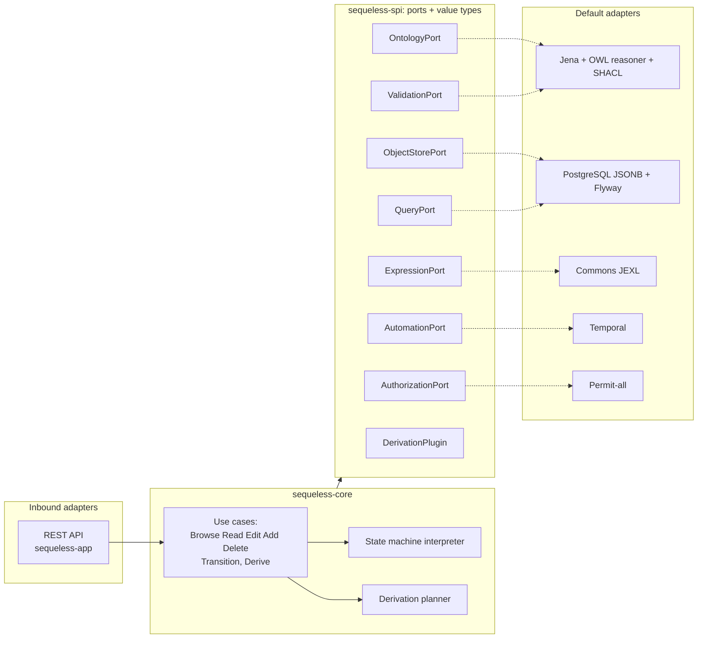

# Architecture overview


## In plain language

The shape of the data is itself data. An OWL ontology, stored as Turtle and loaded into Apache Jena,
describes which business object types exist, their properties, relationships, cardinalities, SHACL
validation shapes, display hints, facets, indexing hints, state machines and derivation rules.
Concepts OWL lacks are expressed with a small custom annotation vocabulary (`sq:`) inside the same
ontology.

The domain core never sees Jena. It defines an immutable **meta-model snapshot** and asks the
ontology port for it. The Jena adapter parses the ontology, runs Jena's built-in OWL reasoner over
the type level, resolves imports and the `sq:` vocabulary, and returns the snapshot. Business object
instances live in PostgreSQL in one generic JSONB table. Every type gets Browse (with facets), Read,
Edit, Add and Delete through a generic REST API. Any type may declare derived properties and a state
machine. Transitions are interpreted in the core, guarded by JEXL expressions behind an expression
port, and their actions are recorded in a transactional outbox and executed durably by Temporal.

Every external concern is a port in the SPI module with one default adapter, selected by a
configuration property, discovered by Spring Boot auto-configuration, and verified by a shared
contract test kit. ArchUnit and Maven dependencies enforce the boundaries.

## The hexagon



Dotted lines are runtime bindings chosen by `sequeless.<port>.adapter` properties. Solid lines are
compile-time dependencies.

## Maven module layout

| Module | Responsibility | May depend on |
|---|---|---|
| `sequeless-parent` | Root POM: versions, plugin management, module list, ArchUnit/japicmp config | none |
| `sequeless-spi` | Outbound port interfaces, immutable value types (records), `AdapterDescriptor` for ServiceLoader, `SpiVersion` | nothing outside the JDK |
| `sequeless-spi-testkit` | Abstract JUnit 5 contract tests per port, plus the reference-domain ontology fixture | `sequeless-spi`, JUnit 5, AssertJ |
| `sequeless-core` | Use cases (inbound API in `…core.api`), BREAD orchestration, structural validation, state machine interpreter, derivation planner, event emission. Pure Java, records, no Lombok | `sequeless-spi` |
| `sequeless-adapter-ontology-jena` | `OntologyPort` and `ValidationPort` via Jena 6 ontapi, built-in OWL reasoner, jena-shacl; Turtle import/export | `sequeless-spi`, Jena, Spring Boot autoconfigure (optional scope), Lombok |
| `sequeless-adapter-persistence-postgres` | `ObjectStorePort` and `QueryPort` on PostgreSQL 18 JSONB; Flyway migrations; outbox table; hint-driven indexes | `sequeless-spi`, JDBC/Spring JDBC, Flyway, Lombok |
| `sequeless-adapter-expression-jexl` | `ExpressionPort` via Commons JEXL 3 in a sandboxed, side-effect-free configuration | `sequeless-spi`, JEXL |
| `sequeless-adapter-automation-temporal` | `AutomationPort` via Temporal Java SDK: outbox relay, action workflows, timers, signals | `sequeless-spi`, Temporal SDK, Spring Boot starter |
| `sequeless-adapter-automation-inprocess` | `AutomationPort` test/dev adapter: synchronous executor over the outbox | `sequeless-spi` |
| `sequeless-adapter-authz-permitall` | `AuthorizationPort` that allows everything | `sequeless-spi` |
| `sequeless-app` | Spring Boot application: REST inbound adapter, wiring, Actuator, OpenAPI, ArchUnit tests, end-to-end tests with Testcontainers | everything above |

Rules enforced by ArchUnit in `sequeless-app` and by Maven scopes:

- `sequeless-spi` imports nothing outside `java.*`.
- `sequeless-core` imports only `java.*` and `sequeless-spi`.
- No adapter imports another adapter or `sequeless-core`.
- Only `sequeless-app` may reference Spring MVC, and only the REST package may reference core use cases.
- Lombok is banned from `sequeless-spi` and `sequeless-core` (compiler plugin not configured there).

Inbound use-case interfaces live in `sequeless-core` package `…core.api`, not in the SPI. The SPI is
for adapter writers; inbound adapters are rarer and may depend on core.

## Port catalogue

| Port | Purpose | Default adapter | Plausible alternatives | Property |
|---|---|---|---|---|
| `OntologyPort` | Parse, reason, resolve and snapshot the ontology; import/export Turtle | `jena` | `rdf4j`, external DL reasoner, static YAML for tests | `sequeless.ontology.adapter=jena` |
| `ValidationPort` | Validate a business object against shapes | `shacl` (Jena module) | `noop`, JSON Schema | `sequeless.validation.adapter=shacl` |
| `ObjectStorePort` | Atomic commit of object mutations plus outbox rows; read by id; ontology document storage | `postgres` | `inmemory`, MongoDB, Neo4j | `sequeless.persistence.adapter=postgres` |
| `QueryPort` | Filtered, sorted, paged browse; facet counts; text search; aggregations for rollups | `postgres` | OpenSearch, SPARQL endpoint | `sequeless.query.adapter=postgres` |
| `ExpressionPort` | Evaluate guard expressions against an object context | `jexl` | SpEL, GraalJS | `sequeless.expression.adapter=jexl` |
| `AutomationPort` | Durably execute transition actions, timers and external signals from the outbox | `temporal` | `inprocess` | `sequeless.automation.adapter=temporal` |
| `AuthorizationPort` | Decide whether a principal may perform an operation on a type, object or field | `permit-all` | Spring Security + OIDC | `sequeless.authz.adapter=permit-all` |
| `DerivationPlugin` | Named code derivation used when a rule declares `sq:Plugin` | none (registry) | any | discovered by ServiceLoader, named in ontology |
| `ClockPort`, `IdGenerator` | Deterministic time and ids for tests | core defaults | — | none |

Illustrative signatures (final shape is decided in the phase that introduces the port):

```java
public interface OntologyPort {
    MetaModelSnapshot snapshot(Scope scope);                 // reasoned, imports resolved
    OntologyDocument export(Scope scope, OntologyFormat format);
    ImportReport importDocument(Scope scope, OntologyDocument document, ImportMode mode);
}

public interface ObjectStorePort {
    CommitResult commit(Scope scope, ChangeSet changes);     // mutations + outbox rows, atomic
    Optional<BusinessObject> find(Scope scope, TypeRef type, ObjectId id);
}

public interface QueryPort {
    QueryResult query(Scope scope, MetaModelSnapshot model, Query query);
    AggregateResult aggregate(Scope scope, MetaModelSnapshot model, AggregateRequest request);
}

public interface AutomationPort {
    void dispatch(Scope scope, OutboxEntry entry);           // idempotent by entry id
}
```

## SPI approach

**Discovery.** Each adapter module ships a Spring Boot auto-configuration registered in
`META-INF/spring/org.springframework.boot.autoconfigure.AutoConfiguration.imports`, guarded by
`@ConditionalOnProperty(name = "sequeless.<port>.adapter", havingValue = "<name>")`. This is the
recommended mechanism: it gives conditional wiring, property binding and startup failure analysis
for free. Each adapter also registers an `AdapterDescriptor` (name, port, SPI version range) via
`META-INF/services` so the app can list available adapters and a non-Spring harness can find them.
Startup fails with a clear message if a property names an adapter that is not on the classpath.

**Registration.** Exactly one bean per port must exist. `sequeless-app` contains a
`PortRegistry` check that fails fast on zero or multiple candidates.

**Versioning.** `sequeless-spi` follows semantic versioning independently of the app. A
`SpiVersion` constant is exposed; descriptors declare a compatible range; the japicmp Maven plugin
fails the build on a binary-incompatible change without a major bump.

**Compliance.** `sequeless-spi-testkit` publishes one abstract contract test class per port (for
example `ObjectStoreContract`, `QueryContract`, `OntologyContract`, `AutomationContract`). An
adapter test extends the class and supplies a factory. Contracts cover the reference domain,
optimistic locking, atomicity of commit with outbox rows, facet counts, and idempotent dispatch.
An adapter is compliant when it passes the kit.

## Runtime and operations defaults

Java 25, Spring Boot 4.1.x, Maven multi-module, PostgreSQL 18, Temporal server via Docker Compose,
Flyway, Testcontainers, Micrometer and OpenTelemetry via Actuator, springdoc OpenAPI in the app.
